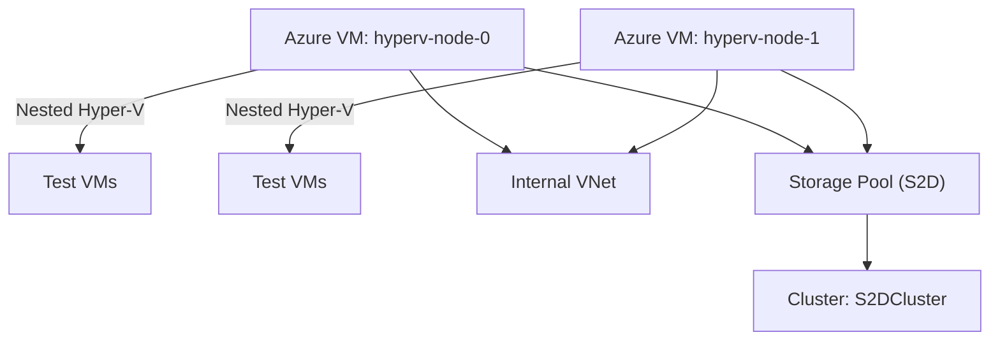

---

## 🧰 Azure Hyper-V S2D Lab (Nested Virtualization)

Simulates a 2-node Hyper-V cluster with **Storage Spaces Direct (S2D)** using **nested virtualization** in Azure. Ideal for testing clustering, failover, and VM provisioning workflows.

---

### 📐 Architecture Overview



---

### 🚀 Deployment Steps

1. **Clone the repo**
   ```bash
   git clone https://github.com/Sergong/azure-hyperv-s2d-lab.git
   cd azure-hyperv-s2d-lab
   ```

2. **Customize variables**
   - Edit `main.tf` to adjust region, VM size, credentials
   - Ensure `bootstrap.ps1` is tailored to your cluster name and IPs

3. **Deploy with Terraform**
   ```bash
   terraform init
   terraform apply
   ```

4. **Post-deployment**
   - Log into each VM
   - Verify Hyper-V and Failover Clustering are installed
   - **WinRM is automatically configured by bootstrap.ps1 for workgroup PowerShell remoting**
   - Run `setup-s2d-cluster.ps1` on hyperv-node-0 to create the cluster and virtual switch
   - **OR** run `setup-virtual-switch.ps1` on both nodes if you only need the virtual switch

---

### 🧪 Features

- Nested Hyper-V with internal switch
- Failover cluster with 2 nodes
- Storage Spaces Direct simulation using local disks
- Ready for test VM provisioning

---

### ⚠️ Gotchas

- Requires **Windows Server Datacenter edition**
- Azure VMs don't support true shared storage — S2D simulates it
- Performance is limited — use for **lab/testing only**
- Ensure VM size supports nested virtualization (e.g., `Standard_D4s_v3`)

### 🔧 Virtual Switch Setup

The nested AlmaLinux VMs require a virtual switch called `InternalLabSwitch`. This is now automatically created by the `setup-s2d-cluster.ps1` script, but you can also create it manually:

**Option 1: Automatic (Recommended)**
```powershell
# Run on hyperv-node-0 (creates cluster AND virtual switch)
.\setup-s2d-cluster.ps1
```

**Option 2: Virtual Switch Only**
```powershell
# Run on both nodes if you only need the virtual switch
.\setup-virtual-switch.ps1
```

**Option 3: Manual Setup**
```powershell
# Create internal switch manually
New-VMSwitch -Name "InternalLabSwitch" -SwitchType Internal

# Configure host IP
New-NetIPAddress -InterfaceAlias "vEthernet (InternalLabSwitch)" -IPAddress "192.168.100.1" -PrefixLength 24

# Optional: Enable NAT for internet access
New-NetNat -Name "InternalLabNAT" -InternalIPInterfaceAddressPrefix "192.168.100.0/24"
```

**Network Configuration:**
- Host IP: `192.168.100.1/24`
- VM IP Range: `192.168.100.2` - `192.168.100.254`
- NAT Gateway: `192.168.100.1` (for internet access)

### 🔗 PowerShell Remoting & WinRM Configuration

For failover clustering to work in a workgroup environment, PowerShell remoting must be properly configured between nodes. This is automatically handled by the `bootstrap.ps1` script.

**What's Configured Automatically:**
- WinRM service enabled and started
- Basic authentication enabled (required for workgroup)
- Trusted hosts configured for both nodes
- Firewall rules created for WinRM ports (5985, 5986)
- Registry settings for workgroup remoting
- Network profiles set to Private

**Manual Configuration (if needed):**
```powershell
# Run on both nodes
.\configure-winrm-workgroup.ps1
```

**Test PowerShell Remoting:**
```powershell
# Test connectivity between nodes
.\test-ps-remoting.ps1

# Manual tests
Test-WSMan hyperv-node-0
Test-WSMan hyperv-node-1
Invoke-Command -ComputerName hyperv-node-1 -ScriptBlock { Get-ComputerInfo } -Credential (Get-Credential)
```

**Credentials for Clustering:**
- Use: `.\Administrator` or `COMPUTERNAME\Administrator`
- Both nodes should have the same local Administrator password
- Domain credentials are not required in workgroup mode

---

### 📄 Files

| File            | Purpose                                      |
|-----------------|----------------------------------------------|
| `main.tf`       | Terraform config for Azure infrastructure    |
| `bootstrap.ps1` | PowerShell script to configure Hyper-V + S2D |
| `README.md`     | This file — setup guide and usage notes      |

---

### Time Estimation

**Total Estimated Time: 25-35 minutes**

#### Breakdown:

1. Terraform Infrastructure Deployment (8-12 minutes)
   - Resource Group: ~30 seconds
   - Virtual Network & Subnet: ~1-2 minutes
   - Public IPs: ~1 minute
   - Network Security Group: ~1 minute
   - Network Interfaces: ~2 minutes
   - VM Creation (2x Standard_D4s_v3): ~5-8 minutes
   - OS disk allocation and VM provisioning
   - Network attachment
   - Boot diagnostics setup

2. Windows Boot & Initial Setup (5-8 minutes)
   - Windows Server 2025 first boot: ~3-5 minutes
   - Windows Updates/patches (if any): ~2-3 minutes
   - AutoLogon configuration: ~30 seconds

3. Bootstrap Script Execution (12-15 minutes)
   - Install-WindowsFeature (Hyper-V, Failover-Clustering, FS-FileServer): ~8-12 minutes
   - This includes a mandatory restart after Hyper-V installation
   - Second boot after restart: ~2-3 minutes

4. Setup-s2d-cluster Script Execution (5-10 minutes)
   - VM Switch creation: ~30 seconds
   - Storage Pool/Volume creation: ~1-2 minutes
   - Cluster validation (Test-Cluster): ~2-3 minutes
   - Cluster creation (New-Cluster): ~1-2 minutes
   - Enable Storage Spaces Direct: ~1-2 minutes

#### Factors That Could Affect Timing:

**Faster (+):**
- UK South region typically has good performance
- Standard_D4s_v3 VMs are well-provisioned
- Your current internet connection speed

**Slower (-):**
- Azure region load at deployment time
- Windows Update requirements
- Cluster validation issues (network/storage)
- If Azure needs to move VMs to different hosts

*Critical Points:*
1. Automatic Restart: The script will restart both VMs after installing Hyper-V (this is mandatory)
2. Cluster Operations: The most time-consuming parts are the Windows Feature installations and cluster validation
3. Storage Spaces Direct: Can take a few minutes to initialize properly

*Monitoring Progress:*
- Use Azure Portal to monitor VM status
- RDP into VMs to check bootstrap script progress
- Check Windows Event Logs if needed


# Nested AlmaLinux Lab with Cloud-Init

This is a streamlined, cloud-init based approach to automate nested AlmaLinux VM provisioning inside your Azure-based Hyper-V cluster. Using Packer templates and cloud-init, you can build once and deploy many VMs with unique configurations.

---

## 📁 Repo Structure: `NestedAlmaLab`

```plaintext
NestedAlmaLab/
├── README.md                                    # Comprehensive documentation
├── scripts/
│   ├── build-cloudinit-template.ps1            # Builds the cloud-init template
│   ├── deploy-with-cloudinit.ps1               # Deploys VMs with cloud-init config  
│   ├── deploy-examples.ps1                     # Example deployment scenarios
│   └── fetch_iso.ps1                           # Downloads AlmaLinux ISO
└── templates/
    └── AlmaLinux/
        └── hyperv/
            └── ks-with-cloudinit.cfg            # Cloud-init kickstart file
```

---

## 🚀 Quick Start: Cloud-Init Approach

### 1. Build the Template (One Time)

```powershell
# Navigate to NestedAlmaLab directory
cd NestedAlmaLab

# Download AlmaLinux ISO (if needed)
.\scripts\fetch_iso.ps1

# Build cloud-init enabled template
.\scripts\build-cloudinit-template.ps1 -Generation 1
```

### 2. Deploy VMs with Unique Configurations

```powershell
# Deploy single test VM
.\scripts\deploy-with-cloudinit.ps1 -VMCount 1 -StartVMs

# Deploy multiple VMs with custom network
.\scripts\deploy-with-cloudinit.ps1 -VMCount 3 -NetworkSubnet '192.168.100' -StartVMs

# Deploy with custom user and SSH key
.\scripts\deploy-with-cloudinit.ps1 -VMCount 2 -Username 'admin' -SSHPublicKeyPath '~\.ssh\id_rsa.pub' -StartVMs
```

### 3. Access Your VMs

```bash
# SSH into deployed VMs
ssh labuser@192.168.1.101  # Default user and IP
ssh admin@192.168.100.101  # Custom user example
```

---

## 🌟 Key Benefits of Cloud-Init Approach

- **Build Once, Deploy Many**: Create a single template, deploy VMs with unique configs
- **Static IP Management**: Automatic IP assignment per deployment  
- **User Management**: Custom users with SSH keys and sudo access
- **Security Hardened**: Secure defaults for deployed VMs
- **Fully Automated**: No manual intervention required
- **Nested Virtualization Ready**: Pre-configured for complex lab scenarios

---

## 📋 Deployment Examples

### Development Environment
```powershell
# Single VM for development
.\scripts\deploy-with-cloudinit.ps1 -VMCount 1 -Username 'developer' -Memory 4096 -CPUs 4 -StartVMs
```

### Testing Cluster
```powershell
# 5-node cluster on isolated network
.\scripts\deploy-with-cloudinit.ps1 -VMCount 5 -NetworkSubnet '10.0.100' -SwitchName 'Internal' -StartVMs
```

### Production-Like Setup
```powershell
# Multi-node with SSH keys and custom resources
.\scripts\deploy-with-cloudinit.ps1 `
    -VMCount 3 `
    -NetworkSubnet '172.16.10' `
    -Username 'sysadmin' `
    -SSHPublicKeyPath '~\.ssh\id_ed25519.pub' `
    -Memory 8192 `
    -CPUs 6 `
    -StartVMs
```

---

## 🔧 Making VMs Highly Available

After deploying VMs with cloud-init, you can make them highly available in your cluster:

```powershell
# Make all cloud-init VMs highly available
Get-VM AlmaLinux-CloudInit-* | ForEach-Object {
    Add-ClusterVirtualMachineRole -VMName $_.Name -Cluster S2DCluster
}

# Check HA status
Get-ClusterResource | Where-Object ResourceType -eq 'Virtual Machine'

# Manual failover test
Move-ClusterVirtualMachineRole -Name 'AlmaLinux-CloudInit-01' -Node 'hyperv-node-1'
```

**What HA provides:**
- Automatic failover between cluster nodes
- VM health monitoring and recovery
- Storage migration to Cluster Shared Volume
- Load balancing across nodes
- High availability for critical workloads

---

## 🎯 Advanced Configuration

For advanced use cases, see the detailed documentation in `NestedAlmaLab/README.md`:

- Custom kickstart modifications
- Extended cloud-init modules
- Integration with Ansible, Terraform
- Security hardening options
- Troubleshooting and logging

```powershell
# View comprehensive documentation
Get-Content NestedAlmaLab\README.md
```


