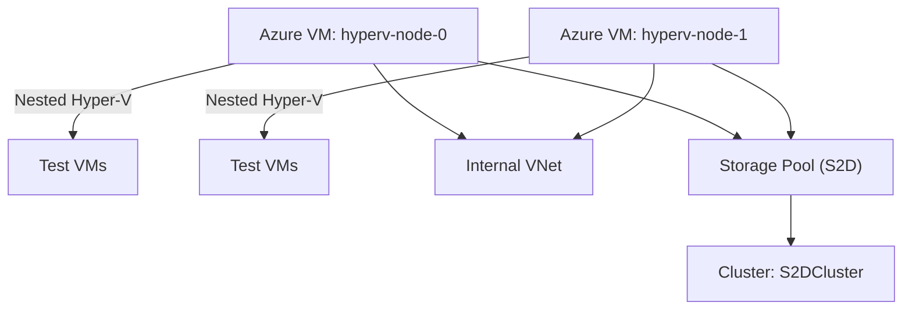

---

## 🧰 Azure Hyper-V S2D Lab (Nested Virtualization)

Simulates a 2-node Hyper-V cluster with **Storage Spaces Direct (S2D)** using **nested virtualization** in Azure. Ideal for testing clustering, failover, and VM provisioning workflows.

---

### 📐 Architecture Overview



---

### 🚀 Deployment Steps

1. **Clone the repo**
   ```bash
   git clone https://github.com/YOUR_USERNAME/azure-hyperv-s2d-lab.git
   cd azure-hyperv-s2d-lab
   ```

2. **Customize variables**
   - Edit `main.tf` to adjust region, VM size, credentials
   - Ensure `bootstrap.ps1` is tailored to your cluster name and IPs

3. **Deploy with Terraform**
   ```bash
   terraform init
   terraform apply
   ```

4. **Post-deployment**
   - Log into each VM
   - Verify Hyper-V and Failover Clustering are installed
   - Run `bootstrap.ps1` to configure S2D and create the cluster

---

### 🧪 Features

- Nested Hyper-V with internal switch
- Failover cluster with 2 nodes
- Storage Spaces Direct simulation using local disks
- Ready for test VM provisioning

---

### ⚠️ Gotchas

- Requires **Windows Server Datacenter edition**
- Azure VMs don’t support true shared storage — S2D simulates it
- Performance is limited — use for **lab/testing only**
- Ensure VM size supports nested virtualization (e.g., `Standard_D4s_v3`)

---

### 📄 Files

| File            | Purpose                                      |
|-----------------|----------------------------------------------|
| `main.tf`       | Terraform config for Azure infrastructure    |
| `bootstrap.ps1` | PowerShell script to configure Hyper-V + S2D |
| `README.md`     | This file — setup guide and usage notes      |

---

# Nested VMs Repo 

Absolutely, Serge — here’s how we can scaffold a reusable, versioned repo to automate nested AlmaLinux provisioning inside your Azure-based Hyper-V cluster. This structure includes param-driven VM creation, ISO fetch logic, unattended installation via Kickstart, and support for post-install bootstraps. Clean, sharable, and future-proof.

---

## 📁 Repo Structure: `NestedAlmaLab`

```plaintext
NestedAlmaLab/
├── README.md
├── config/
│   ├── alma-ks-v1.cfg
│   ├── alma-ks-v2.cfg
│   └── config.yaml                  # Global config (VM count, memory, etc.)
├── scripts/
│   ├── fetch_iso.ps1               # Downloads AlmaLinux ISO
│   ├── provision-vms.ps1           # Core provisioning logic
│   ├── postinstall.ps1             # Optional: inject bootstrap scripts post-install
├── templates/
│   └── AlmaLinux/
│       └── v1/
│           └── ks.cfg              # Kickstart for v1
│       └── v2/
│           └── ks.cfg              # Kickstart for v2
├── assets/
│   └── AlmaLinux-latest-x86_64.iso
└── logs/
    └── install-log.txt
```

---

## 🧰 `fetch_iso.ps1` – ISO Automation

```powershell
# Download latest AlmaLinux ISO
$isoUrl = "https://repo.almalinux.org/almalinux/9/isos/x86_64/AlmaLinux-9-latest-x86_64.iso"
$isoDest = "C:\ISOs\AlmaLinux-latest-x86_64.iso"

Invoke-WebRequest -Uri $isoUrl -OutFile $isoDest -UseBasicParsing
Write-Host "✅ ISO downloaded to $isoDest"
```

---

## 🔧 `config.yaml` – Lab Config Sample

```yaml
vm_prefix: "AlmaVM"
vm_count: 2
vm_memory: 2GB
vm_disk_size_gb: 30
vm_generation: 2
vm_switch: "InternalLabSwitch"
ks_version: "v1"
iso_path: "C:\\ISOs\\AlmaLinux-latest-x86_64.iso"
ks_path: "config\\alma-ks-v1.cfg"
```

---

## 🚀 `provision-vms.ps1` – Nested VM Provisioner

```powershell
# Import config
$config = ConvertFrom-Yaml (Get-Content "config\config.yaml" -Raw)

# Create VMs
for ($i = 1; $i -le $config.vm_count; $i++) {
    $vmName  = "$($config.vm_prefix)-$i"
    $vmPath  = "C:\HyperV\VMs\$vmName"
    $vhdPath = "$vmPath\$vmName.vhdx"

    # Create folders
    New-Item -ItemType Directory -Path $vmPath -Force | Out-Null

    # Create VM and attach ISO
    New-VHD -Path $vhdPath -SizeBytes ($config.vm_disk_size_gb * 1GB) -Dynamic
    New-VM -Name $vmName -MemoryStartupBytes $config.vm_memory -Generation $config.vm_generation `
           -SwitchName $config.vm_switch -Path $vmPath
    Add-VMHardDiskDrive -VMName $vmName -Path $vhdPath
    Add-VMDvdDrive -VMName $vmName -Path $config.iso_path
    Set-VMFirmware -VMName $vmName -EnableSecureBoot Off
    Set-VMProcessor -VMName $vmName -ExposeVirtualizationExtensions $true

    # Start VM
    Start-VM -Name $vmName
}
```

---

## 🔁 `postinstall.ps1` – Bootstrap Injection (Optional)

```powershell
# Sample: copy SSH key, inject Ansible agent
$vmName = "AlmaVM-1"
$vmIp   = "192.168.100.101"

# Wait for SSH port
while (-not (Test-NetConnection $vmIp -Port 22).TcpTestSucceeded) {
    Start-Sleep -Seconds 10
}

# Copy postinstall.sh or run remote scripts
scp .\scripts\postinstall.sh root@$vmIp:/root/
ssh root@$vmIp "bash /root/postinstall.sh"
```


