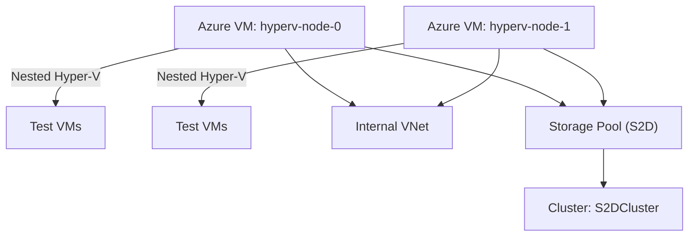

---

## 🧰 Azure Hyper-V S2D Lab (Nested Virtualization)

Simulates a 2-node Hyper-V cluster with **Storage Spaces Direct (S2D)** using **nested virtualization** in Azure. Ideal for testing clustering, failover, and VM provisioning workflows.

---

### 📐 Architecture Overview



---

### 🚀 Deployment Steps

1. **Clone the repo**
   ```bash
   git clone https://github.com/Sergong/azure-hyperv-s2d-lab.git
   cd azure-hyperv-s2d-lab
   ```

2. **Customize variables**
   - Edit `main.tf` to adjust region, VM size, credentials
   - Ensure `bootstrap.ps1` is tailored to your cluster name and IPs

3. **Deploy with Terraform**
   ```bash
   terraform init
   terraform apply
   ```

4. **Post-deployment**
   - Log into each VM
   - Verify Hyper-V and Failover Clustering are installed
   - **WinRM is automatically configured by bootstrap.ps1 for workgroup PowerShell remoting**
   - Run `setup-s2d-cluster.ps1` on hyperv-node-0 to create the cluster and virtual switch
   - **OR** run `setup-virtual-switch.ps1` on both nodes if you only need the virtual switch

---

### 🧪 Features

- Nested Hyper-V with internal switch
- Failover cluster with 2 nodes
- Storage Spaces Direct simulation using local disks
- Ready for test VM provisioning

---

### ⚠️ Gotchas

- Requires **Windows Server Datacenter edition**
- Azure VMs don't support true shared storage — S2D simulates it
- Performance is limited — use for **lab/testing only**
- Ensure VM size supports nested virtualization (e.g., `Standard_D4s_v3`)

### 🔧 Virtual Switch Setup

The nested AlmaLinux VMs require a virtual switch called `InternalLabSwitch`. This is now automatically created by the `setup-s2d-cluster.ps1` script, but you can also create it manually:

**Option 1: Automatic (Recommended)**
```powershell
# Run on hyperv-node-0 (creates cluster AND virtual switch)
.\setup-s2d-cluster.ps1
```

**Option 2: Virtual Switch Only**
```powershell
# Run on both nodes if you only need the virtual switch
.\setup-virtual-switch.ps1
```

**Option 3: Manual Setup**
```powershell
# Create internal switch manually
New-VMSwitch -Name "InternalLabSwitch" -SwitchType Internal

# Configure host IP
New-NetIPAddress -InterfaceAlias "vEthernet (InternalLabSwitch)" -IPAddress "192.168.100.1" -PrefixLength 24

# Optional: Enable NAT for internet access
New-NetNat -Name "InternalLabNAT" -InternalIPInterfaceAddressPrefix "192.168.100.0/24"
```

**Network Configuration:**
- Host IP: `192.168.100.1/24`
- VM IP Range: `192.168.100.2` - `192.168.100.254`
- NAT Gateway: `192.168.100.1` (for internet access)

### 🔗 PowerShell Remoting & WinRM Configuration

For failover clustering to work in a workgroup environment, PowerShell remoting must be properly configured between nodes. This is automatically handled by the `bootstrap.ps1` script.

**What's Configured Automatically:**
- WinRM service enabled and started
- Basic authentication enabled (required for workgroup)
- Trusted hosts configured for both nodes
- Firewall rules created for WinRM ports (5985, 5986)
- Registry settings for workgroup remoting
- Network profiles set to Private

**Manual Configuration (if needed):**
```powershell
# Run on both nodes
.\configure-winrm-workgroup.ps1
```

**Test PowerShell Remoting:**
```powershell
# Test connectivity between nodes
.\test-ps-remoting.ps1

# Manual tests
Test-WSMan hyperv-node-0
Test-WSMan hyperv-node-1
Invoke-Command -ComputerName hyperv-node-1 -ScriptBlock { Get-ComputerInfo } -Credential (Get-Credential)
```

**Credentials for Clustering:**
- Use: `.\Administrator` or `COMPUTERNAME\Administrator`
- Both nodes should have the same local Administrator password
- Domain credentials are not required in workgroup mode

---

### 📄 Files

| File            | Purpose                                      |
|-----------------|----------------------------------------------|
| `main.tf`       | Terraform config for Azure infrastructure    |
| `bootstrap.ps1` | PowerShell script to configure Hyper-V + S2D |
| `README.md`     | This file — setup guide and usage notes      |

---

### Time Estimation

**Total Estimated Time: 25-35 minutes**

#### Breakdown:

1. Terraform Infrastructure Deployment (8-12 minutes)
   - Resource Group: ~30 seconds
   - Virtual Network & Subnet: ~1-2 minutes
   - Public IPs: ~1 minute
   - Network Security Group: ~1 minute
   - Network Interfaces: ~2 minutes
   - VM Creation (2x Standard_D4s_v3): ~5-8 minutes
   - OS disk allocation and VM provisioning
   - Network attachment
   - Boot diagnostics setup

2. Windows Boot & Initial Setup (5-8 minutes)
   - Windows Server 2025 first boot: ~3-5 minutes
   - Windows Updates/patches (if any): ~2-3 minutes
   - AutoLogon configuration: ~30 seconds

1. Bootstrap Script Execution (12-15 minutes)
   - Install-WindowsFeature (Hyper-V, Failover-Clustering, FS-FileServer): ~8-12 minutes
   - This includes a mandatory restart after Hyper-V installation
   - Second boot after restart: ~2-3 minutes
   - VM Switch creation: ~30 seconds
   - Storage Pool/Volume creation: ~1-2 minutes
   - Cluster validation (Test-Cluster): ~2-3 minutes
   - Cluster creation (New-Cluster): ~1-2 minutes
   - Enable Storage Spaces Direct: ~1-2 minutes

#### Factors That Could Affect Timing:

**Faster (+):**
- UK South region typically has good performance
- Standard_D4s_v3 VMs are well-provisioned
- Your current internet connection speed

**Slower (-):**
- Azure region load at deployment time
- Windows Update requirements
- Cluster validation issues (network/storage)
- If Azure needs to move VMs to different hosts

*Critical Points:*
1. Automatic Restart: The script will restart both VMs after installing Hyper-V (this is mandatory)
2. Cluster Operations: The most time-consuming parts are the Windows Feature installations and cluster validation
3. Storage Spaces Direct: Can take a few minutes to initialize properly

*Monitoring Progress:*
- Use Azure Portal to monitor VM status
- RDP into VMs to check bootstrap script progress
- Check Windows Event Logs if needed


# Nested VMs Repo 

This is a reusable, versioned repo to automate nested AlmaLinux provisioning inside your Azure-based Hyper-V cluster. This structure includes param-driven VM creation, ISO fetch logic, unattended installation via Kickstart, and support for post-install bootstraps. Clean, sharable, and future-proof.

---

## 📁 Repo Structure: `NestedAlmaLab`

```plaintext
NestedAlmaLab/
├── README.md
├── scripts/
│   ├── config.yaml                  # Global config (VM count, memory, etc.)
│   ├── fetch_iso.ps1               # Downloads AlmaLinux ISO
│   ├── provision-vms.ps1           # Core provisioning logic
│   ├── postinstall.ps1             # Optional: inject bootstrap scripts post-install
│   └── postinstall.sh              # Optional: Run configuration inside the Alma VM
└── templates/
    └── AlmaLinux/
        └── v1/
            └── ks.cfg              # Kickstart for v1
        └── v2/
            └── ks.cfg              # Kickstart for v2
```

---

## 🧰 `fetch_iso.ps1` – ISO Automation

```powershell
# Download latest AlmaLinux ISO
$isoUrl = "https://repo.almalinux.org/almalinux/9/isos/x86_64/AlmaLinux-9-latest-x86_64.iso"
$isoDest = "C:\ISOs\AlmaLinux-latest-x86_64.iso"

Invoke-WebRequest -Uri $isoUrl -OutFile $isoDest -UseBasicParsing
Write-Host "✅ ISO downloaded to $isoDest"
```

---

## 🔧 `config.yaml` – Lab Config Sample

```yaml
vm_prefix: "AlmaVM"
vm_count: 2
vm_memory: 2GB
vm_disk_size_gb: 30
vm_generation: 2
vm_switch: "InternalLabSwitch"
ks_version: "v1"
iso_path: "C:\\ISOs\\AlmaLinux-latest-x86_64.iso"
ks_path: "config\\alma-ks-v1.cfg"
```

---

## 🚀 `provision-vms.ps1` – Nested VM Provisioner

```powershell
# Import config
$config = ConvertFrom-Yaml (Get-Content "config\config.yaml" -Raw)

# Create VMs
for ($i = 1; $i -le $config.vm_count; $i++) {
    $vmName  = "$($config.vm_prefix)-$i"
    $vmPath  = "C:\HyperV\VMs\$vmName"
    $vhdPath = "$vmPath\$vmName.vhdx"

    # Create folders
    New-Item -ItemType Directory -Path $vmPath -Force | Out-Null

    # Create VM and attach ISO
    New-VHD -Path $vhdPath -SizeBytes ($config.vm_disk_size_gb * 1GB) -Dynamic
    New-VM -Name $vmName -MemoryStartupBytes $config.vm_memory -Generation $config.vm_generation `
           -SwitchName $config.vm_switch -Path $vmPath
    Add-VMHardDiskDrive -VMName $vmName -Path $vhdPath
    Add-VMDvdDrive -VMName $vmName -Path $config.iso_path
    Set-VMFirmware -VMName $vmName -EnableSecureBoot Off
    Set-VMProcessor -VMName $vmName -ExposeVirtualizationExtensions $true

    # Start VM
    Start-VM -Name $vmName
}
```

---

## 🔁 `postinstall.ps1` – Bootstrap Injection (Optional)

```powershell
# Sample: copy SSH key, inject Ansible agent
$vmName = "AlmaVM-1"
$vmIp   = "192.168.100.101"

# Wait for SSH port
while (-not (Test-NetConnection $vmIp -Port 22).TcpTestSucceeded) {
    Start-Sleep -Seconds 10
}

# Copy postinstall.sh or run remote scripts
scp .\scripts\postinstall.sh root@$vmIp:/root/
ssh root@$vmIp "bash /root/postinstall.sh"
```

---

## ⚠️ Known Issues and Solutions

### Kickstart Boot Parameters Issue

**Problem**: The `provision-vms.ps1` script correctly creates VMs and attaches kickstart media, but doesn't automatically pass kernel boot parameters (`inst.ks=...`) to instruct AlmaLinux installer to use the kickstart file.

**Impact**: 
- VMs boot to AlmaLinux installer menu but require manual intervention
- User must press TAB (or 'e' to edit) and add kickstart parameters manually
- This affects both Generation 1 and Generation 2 VMs

**Solutions**:

#### Option 1: Custom ISO with Embedded Kickstart (🔥 Recommended)
Create a custom AlmaLinux ISO with kickstart parameters pre-configured for fully automated installation:

```powershell
# Navigate to the scripts directory
cd NestedAlmaLab\scripts

# Create custom ISO for your VM generation and kickstart version
.\create-custom-iso.ps1 -KickstartVersion v1 -Generation 2

# Update config.yaml to use the custom ISO
# iso_path: "C:\path\to\NestedAlmaLab\custom-iso\AlmaLinux-v1-Gen2-Custom.iso"

# Run normal VM provisioning - now fully automated!
.\provision-vms.ps1
```

**Requirements for Custom ISO**:
- Windows ADK (Assessment and Deployment Kit) - **automatically installed by the script if missing**
- Administrator privileges (required for automatic ADK installation)
- Script will prompt for permission before installing ADK
- Creates ISOs with embedded kickstart parameters for both BIOS and UEFI boot
- Manual ADK installation: https://docs.microsoft.com/en-us/windows-hardware/get-started/adk-install

#### Option 2: Manual Boot Parameters (Current Method)
When VMs boot for the first time:

**For Generation 1 VMs**:
- Press TAB at the boot menu
- Add: `inst.ks=hd:fd0:/ks.cfg inst.text console=tty0 console=ttyS0,115200`
- Press Enter

**For Generation 2 VMs**:
- Press TAB at the boot menu (or 'e' to edit)
- Add: `inst.ks=hd:sdb1:/ks.cfg inst.text console=tty0 console=ttyS0,115200`
- Press Ctrl+X (if using 'e' to edit) or Enter


